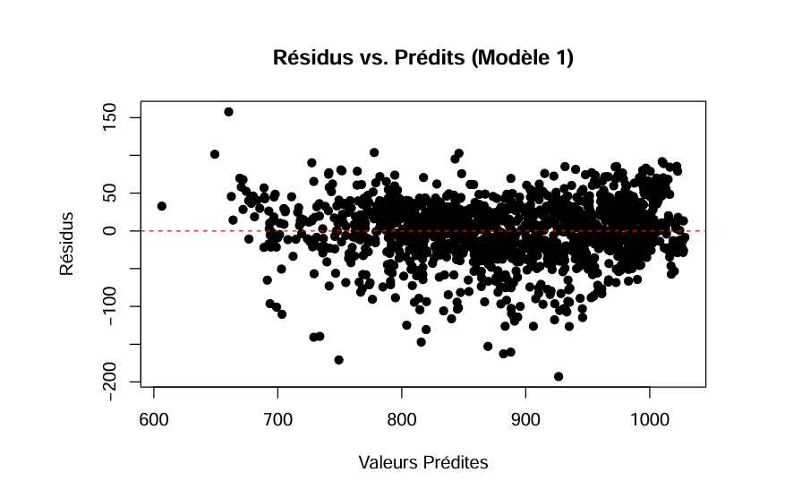
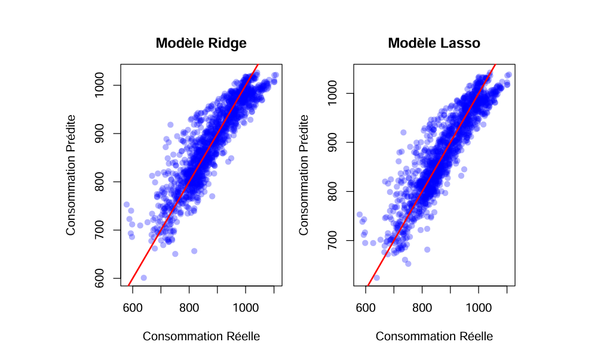
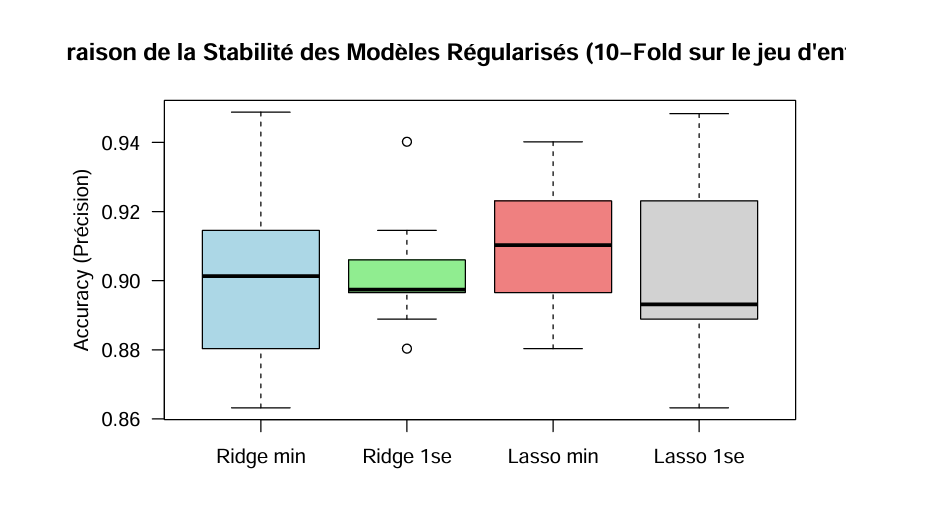

# Electricity-Demand-Prediction-Statistical-Modeling

This repository presents a statistical modeling project focused on electricity demand prediction, developed as part of an advanced course in Regression Methods and Regularization.

The project addresses a real-world energy forecasting problem by building, refining, and validating regression-based models using meteorological and calendar data.  
A strong emphasis is placed on model robustness, interpretability, and methodological rigor rather than black-box prediction.

All analyses and results are fully documented in the accompanying PDF reports.  
The R code is included and commented directly inside these reports.

---

# Project Objectives

Model and predict daily electricity consumption

Identify the key drivers of energy demand

Address common real-world modeling challenges:

- non-linearity  
- multicollinearity  
- seasonality and temporal effects  

Improve predictive performance through feature engineering

Ensure statistical validity and interpretability of the final models

---

# Data Overview

The dataset consists of daily electricity consumption data for Mexico City, combined with:

- meteorological variables (temperature, radiation, humidity)  
- calendar variables (day of week, holidays)  
- contextual indicators (e.g. Covid period)  
- engineered seasonal components  

---

# Methodological Approach

The project follows a progressive and structured modeling strategy.

---

# 1. Baseline Linear Regression

Construction of an initial multiple linear regression model.

Diagnostic analysis revealing:

- strong multicollinearity among predictors  
- inadequate handling of seasonal effects  
- non-linear relationships between temperature and electricity demand  

This initial model provides a useful baseline but highlights structural limitations that motivate more advanced modeling approaches.

---

# 2. Feature Engineering & Model Refinement

Introduction of cyclical seasonal features (sinusoidal encoding).

Modeling temperature non-linearity via polynomial terms.

Careful variable selection to reduce redundancy and mitigate multicollinearity.

Re-estimation and validation of improved models, including regularized regression techniques.

Result: significantly improved stability, interpretability, and predictive accuracy compared to the baseline linear model.

---

# 3. Comparative Analysis & Validation

Comparison of alternative modeling strategies.

Performance evaluation using statistical metrics and residual diagnostics.

Assessment of model coherence, stability, and generalization capability through validation procedures.

The final model achieves a strong balance between performance, robustness, and interpretability.

---

# Key Insights

Temperature is a dominant driver of electricity demand, with a clear non-linear effect.

Seasonal patterns play a critical role and must be explicitly modeled.

Calendar effects materially improve predictive performance.

Well-engineered linear and regularized models can outperform overly complex approaches when properly specified.

---

# Tools & Techniques

Language: R

Techniques:

- Multiple linear regression  
- Feature engineering  
- Regularized regression (Ridge and Lasso)  
- Residual and diagnostic analysis  
- Multicollinearity assessment  

Focus: interpretable and statistically sound modeling.

---

# Repository Content

TP1_MRR_Schneider_Wong.pdf – Baseline modeling and diagnostic analysis  

TP2_MRR_Schneider_Wong.pdf – Feature engineering, regularization, and model improvement  

TP3_MRR.pdf – Comparative analysis and validation  

All R scripts are embedded and commented directly within the reports.

---

# Authors

| Name | Links |
|------|-------|
| Alexis Schneider | [LinkedIn](https://www.linkedin.com/in/alexis-schneider-a91079325/) | [GitHub](https://github.com/Alexis-Schneider) |
| Kelvin Wong |  [GitHub](https://github.com/KelvinWong94)

---

# Why this project matters

This project demonstrates the ability to:

- approach a real forecasting problem with methodological discipline  
- translate data issues into appropriate statistical solutions  
- apply regularization techniques to improve robustness and interpretability  
- produce models suitable for informed decision-making  
- document results clearly for both technical and non-technical audiences  
